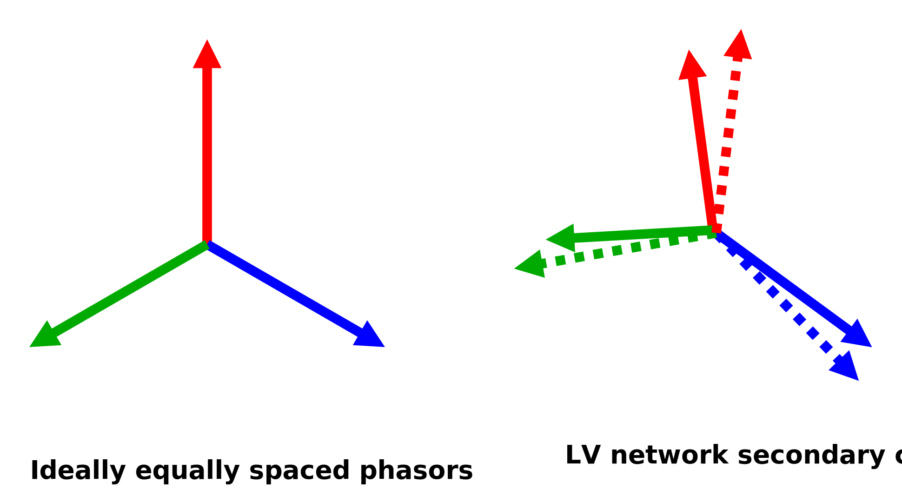
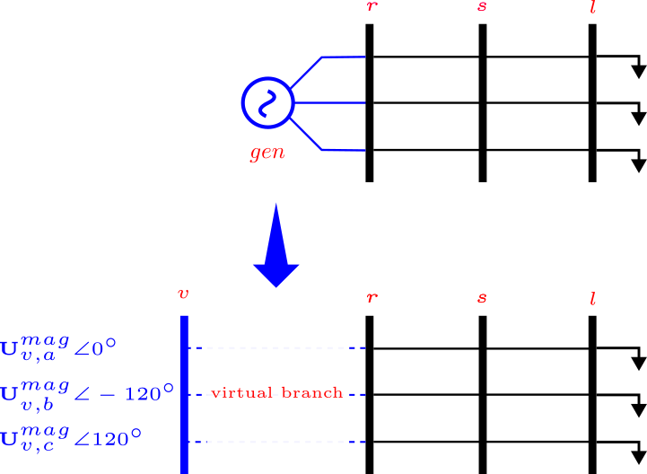
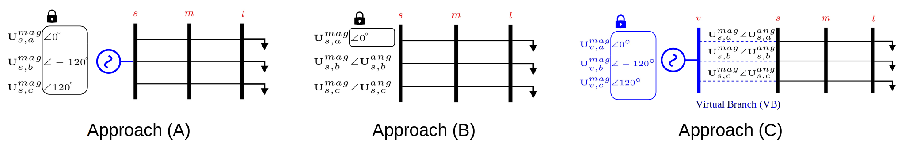

# Angular Reference Models 
As of version 0.8.0, PMDSE provides the ability to constraint voltage angles bounds, mostly used to define angular reference models for the reference bus of the network. 

## Background 

Conventionally, the slack bus voltage phasor is used as the reference phasor for the rest of the network. In single-phase analysis that phasor is kept at 1 pu and 0 degrees. However, in three-phase analysis, the slack bus voltage phasor magnitude is kept at 1 pu and the angles at [0, -120, 120] degrees. This is based on the assumption that the voltage angles at the slack bus are equally spaced by 120 degrees. While this assumption is valid for stiff and balanced networks, it does not hold for unbalanced low voltage networks. 




The stiffness, indicating how balanced and equally spaced the phasor angles are, can be analytically determined by modeling an equivalent generator, where the generator's short circuit capability represents the upstream network impedance (Thevenin equivalent). In PowerModelsDistribution.jl, the slack bus can be identified by looking up the bus with `bus_type = 3` property in the network's mathematical model. PowerModelsDistribution.jl represents that slack bus with a virtual generator connected to a virtual bus via a virtual branch, with branch parameters based on the generator's short circuit capability, as shown in the figure below.



From a state estimation perspective, measurements from the virtual branch (slack bus of PowerModelsDistribution.jl) are non-existent. Moreover, Short circuit capabilities and virtual branch parameters often rely on assumptions about the substation transformer and upstream network which might add up into the innacuracy in the estimation results.

Therefore, it is important to have the ability to define the voltage angle reference for the network based on the measurements available and free from these assumptions. 

Moreover, this feature enhances the estimation accuracy in the case of highly unbalanced distribution networks, where the voltage angles of the slack bus are not necessarily equally spaced by 120 degrees. Furthermore, this angular reference relaxation enables state estimation with respect to any bus as the reference bus, not necessarily the substations bus. This can be useful in case of having a bus with phasor measurement, where all phasors can be referred to that bus.

## Angular Reference Modeling Approaches for Distribution System State Estimation (DSSE)
Based on the above discussion, and related literature on the topic [^1], three approaches are proposed for modeling the angular reference for the network in DSSE:

[^1] : M. Numair, M. Vanin, and D. Van Hertem, "Angular Reference Models for Optimization-based Unbalanced Distribution System State Estimation," in Proc. IEEE PES Innovative Smart Grid Technologies Europe (ISGT Europe), Dubrovnik, Croatia, 2024




### **Approach A: Conventional Symmetrical Reference Angle**

*   This approach designates the substation head bus as a stiff slack bus and **fixes its voltage phasor angles to [0, -120, 120] degrees**, assuming balanced voltage angles.
*   This assumption **may lead to inaccuracies in DSSE, especially in LV networks with significant unbalance**. The errors propagate to other estimated states, such as voltage magnitudes.

### **Approach B: Single Angular Reference**

*   This approach **fixes only the phase "a" voltage angle to 0 degrees (or another arbitrary value), while the angles for phases "b" and "c" are treated as state variables**.
*   This method **captures the unbalance at the reference bus without relying on knowledge of upstream network parameters**.
*   The voltage angles at the substation bus are **relaxed to be estimated by the DSSE framework**, which can lead to more accurate state estimates in unbalanced networks.

### **Approach C: Virtual Bus Approach**

*   This approach introduces **a virtual bus before the substation bus**, allowing for the complete relaxation of voltage phasor angles at the substation bus. This is the typical approach used in the power flow solvers (PowerModelsDistribution.jl). 
*   The **symmetrical angle assumption is then applied to the virtual bus**, and a virtual branch is defined typically using a Thevenin equivalent model of the upstream network or the short circuit capabilities of the equivalent synchronous generator.
*   While potentially more accurate in scenarios with perfect knowledge of upstream network parameters, this approach **suffers from inaccuracies when these parameters are unknown or inaccurately modeled**. This is a significant drawback in real-world LV networks where this information is often unavailable.

## Usage


### **Approach C: Virtual Bus Approach**
The default behaviour of PowerModelsDistribution.jl is to use the virtual bus to represent the slack bus (Approach C) and to define the angular reference for the network. Hence, performing state estimation with the default MATHEMATICAL model from PowerModelsDistribution.jl will result in **assuming measurements at the virtual branch (slack bus)** and the results with then be reliant on the assumptions made about the upstream network (virtual branch parameters).


```julia
# after loading the relevant packages
ntw_path = joinpath(PMDSE.BASE_DIR, "test/data/extra/networks/case3_unbalanced.dss")
msr_path = joinpath(mktempdir(),"temp.csv")
data = PowerModelsDistribution.parse_file(ntw_path; data_model=MATHEMATICAL)
pf_result = _PMD.solve_mc_pf(data, model, ipopt_solver)
write_measurements!(model, data, pf_result, msr_path)
add_measurements!(data, msr_path, actual_meas = true)
data["se_settings"] = Dict{String,Any}("criterion" => "rwlav", "rescaler" => 1)
slv = PMDSE.optimizer_with_attributes(Ipopt.Optimizer, "tol"=>1e-8, "print_level"=>0)
SE_c = _PMDSE.solve_mc_se(math_c, model, ipopt_solver)
```

However in a realistic case measurement are not available at the virtual branch, but at the substation bus. Hence, the virtual bus is removed from  MATHEMATICAL data model. And the substation bus is defined as the slack bus.  Additionally the measurement file at `msr_path` is updated to contain the measurements at the substation bus instead of the virtual bus. 

```julia
(virtual_bus, r_new) = _PMDSE.remove_virtual_bus!(data) 
```

### **Approach A: Conventional Symmetrical Reference Angle**


After removing the virtual bus and defining the substation bus as the slack bus, the conventional approach assumes symmetrical reference angle, by fixing the voltage angles at the substation bus to [0, -120, 120] degrees, and the voltage magnitudes to 1.0 p.u.  

```julia
        math_a = deepcopy(data)
        math_a["bus"]["$(r_new)"]["va"] = deg2rad.([0, -120, 120])
        math_a["bus"]["$(r_new)"]["bus_type"] = 3
        SE_a = _PMDSE.solve_mc_se(math_a, model, ipopt_solver)
```

### **Approach B: Single Angular Reference**

However, for a more flexible approach, PMDSE now offers the ability to bound the voltage angles at the buses between maximum and minimum values instead of fixing them at an exact value. That way the voltage angle at the substation bus can be estimated by the state estimation framework. 


```julia
        math_b = deepcopy(data)
        (virtual_bus, r_new) = _PMDSE.remove_virtual_bus!(math_b) 
        Angles_bound = Inf 
        math_b["bus"]["$(r_new)"]["bus_type"] = 3
        math_b["bus"]["$(r_new)"]["vamax"] = deg2rad.([0.0, -120+Angles_bound, 120+Angles_bound])
        math_b["bus"]["$(r_new)"]["vamin"] = deg2rad.([0.0, -120-Angles_bound, 120-Angles_bound])
        SE_b = _PMDSE.solve_mc_se(math_b, model, ipopt_solver)
```

Here it can be seen that the angles at the substation bus are relaxed except for the phase "*a*" angle which is fixed to 0 degrees. The angles for phases "*b*" and "*c*" are treated as state variables and are estimated by the state estimation framework. This results in better estimation accuracy for voltage mangitudes in unbalanced networks without relying on upstream network parameters.


## Summary

In summary when dealing with unbalanced networks, and in order to not lose accuracy when performing the state estimation, PMDSE now offers the ability to constraint, relax or bound the voltage angles at the slack bus (or any arbitrary bus) using the `vamin` and `vamax` properties of the bus dictionary in the `MATHEMATICAL` model.


