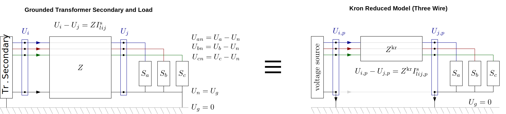
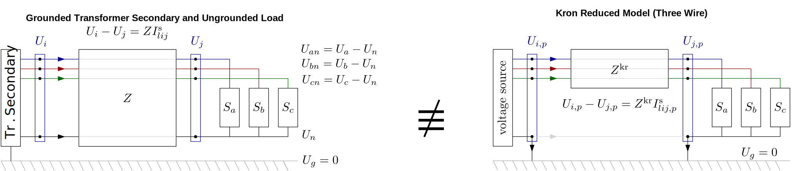

# Explicit Neutral Models for DSSE

As of version 0.8.0, PMDSE support the explicit neutral models from PowerModelsDistribution.jl in the `IVRENPowerModel` formulation. This feature is crucial for the state estimation of low voltage networks when the neutral wire is not solidly grounded at all buses, which is usually the case for European low voltage feeders. 

## Background

A typical European (but this is also true in multiple other parts of the world) low voltage network would have three phases and four wires: three wires for the three-phase lines (L1, L2, L3), one wire for the neutral (N).

In a typical European low voltage installation, the neutral wire is connected to the ground at the transformer secondary, and depending on the load earthing scheme the neutral wire might be connected to the ground at the load side or not. When the neutral is grounded at both the transformer secondary and at the load side, it is safe to assume that the neutral voltage is consistently zero (the same as ground voltage), and hence no current flows through the neutral wire. In that case, kron reduction is an exact approximation for the three-phase network analysis. 



However, in unbalanced networks with sparselt grounded neutral, "neutral shift" occurs in general, i.e., the neutral voltage and currents are nonzero. To capture this phenomenon, mathematical tools that explicitly feature a four-wire model are required, and the commonly used Kron's reduction would result in accuracy loss.

 [^1]

[^1]: Figures adapted from S. Claeys and G. Deconinck, “Distribution Network Modeling: From Simulation Towards Optimization,” 2021. PhD Thesis, KU Leuven.


## Usage
The function `solve_ivr_en_mc_se()` is added to PMDSE to perform state estimation with the explicit neutral models in the IVR formulation. An example (which also relies on PowerModelsDistribution's four-wire capabilities to create synthetic data for the DSSE, is the following:

```julia
import Ipopt
import PowerModelsDistribution as _PMD
import PowerModelsDistributionStateEstimation as _PMDSE

eng_en = _PMD.parse_file(joinpath(_PMDSE.BASE_DIR, "test", "data", "three-bus-en-models", "3bus_4wire.dss"))
msr_path = joinpath(mktempdir(),"temp_msr.csv")

eng_en = _PMD.parse_file(ntw_path)
_PMD.transform_loops!(eng_en)
_PMD.remove_all_bounds!(eng_en)

math_en = _PMD.transform_data_model(eng_en, kron_reduce=false, phase_project=false)

pf_result = _PMD.solve_mc_pf(data, model, Ipopt.Optimizer)
_PMDSE.write_measurements!(model, data, pf_result, msr_path)
_PMDSE.add_measurements!(data, msr_path, actual_meas = true)

data["se_settings"] = Dict{String,Any}("criterion" => "rwlav", "rescaler" => 1)
se_result = _PMDSE.solve_ivr_en_mc_se(data, Ipopt.Optimizer)
```
Note that other than using the new function and carefully parsing four-wire data (see PowerModelsDistribution's documentation), the process is similar to that of DSSE for three-wire models.
