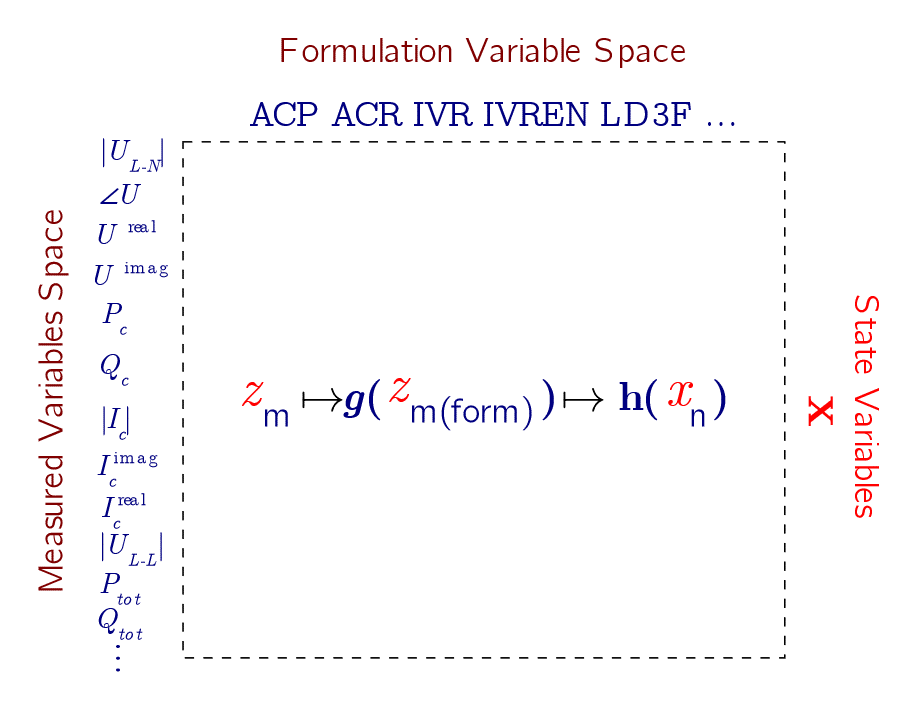

# Measurement Conversion

## Introduction


PMDSE provides a high degree of modularity in terms of the possible measurement space, the package separates three different variable spaces: the measured variables space, the formulation variable space and the state variables. 
 
### Examples of conversion from the measurement space to the formulation space

**In the ACP formulation**

A typical smart meter measures the voltage magnitude, active and reactive powers, thus the **measured variable space** is: $|U_{m}|$, $P_c$ and $Q_c$.
However, if the ACP formulation is used then the **formulation variable space** is: $|U_{m}|$, $\angle U_{a}$, $P_c$ and $Q_c$.
And the **state variable space** is: $|U_{m}|$, $\angle U_{a}$.

In that case it can be seen that the state estimator requires an extra conversion step to calculate the voltage angle $\angle U_{a}$ from the measured space variables.


### In the IVREN formulation

Similarly, if the IVREN formulation is used, the  **measured variables space** remains the same as: $|U_{m}|$, $P_c$ and $Q_c$.

However, the **formulation variable space** is the real and imaginary voltages and currents: $U_{r}$, $U_{i}$, $I_{r}$ and $I_{i}$. So the state estimator requires an extra conversion step to calculate the real and imaginary voltages and currents from the measured space variables. And in that case the **state variable space** is: $U_{r}$, $U_{i}$.




Any network formulation has a specific variable space, e.g., ACP includes `vm`,
`va`, `px` and `qx`[^1]. `w` = `vm^2` is the lifted voltage variable native to branch flow conic and linear forms.
The conversions for the reduced formulations work identically as their non-reduced equivalent.

[^1]: The **x** in `px`, `qx`, `cmx`, `cax`, `crx` and `cix`
      indicates that these variables exists for branches (~), generators (g) and
      loads (-). In order to capture the variable for a specific element it
      should be rewritten, e.g., `"px"` respectively becomes `"p"`, `"pg"` and
      `"pd"`.


| -         | vm  | va  | cmx | cax | crx | cix | px  | qx  | vr  | vi  |  w  | Ptot | Qtot | vll |
| :-------- | :-- | :-- | :-- | :-- | :-- | :-- | :-- | :-- | :-- | :-- | :-- | :--  | :--  | :-- |
| **ACP**   | N   | N   | SF  | X   | F   | F   | N   | N   | X   | X   |  X  |  Σ   |  Σ   |  S  |
| **ACR**   | S  | PP   | SF  | X   | MF  | MF  | N   | N   | N   | N   |  X  |  Σ   |  Σ   |     |
| **IVR**   | S  | PP   | S   | PP  | N   | N   | M   | M   | N   | N   |  X  |  Σ   |  Σ   |  S  |
| **SDP**   | X  |  X   | X   | X   | X   | X   | N*  | N*  | X   | X   |  N  |  Σ   |  Σ   |     |
| **LD3F**  | S  |  X   | SF  | X   | X   | X   | N   | N   | X   | X   |  N  |  Σ   |  Σ   |     |
| **IVREN** | S  | PP   | S   | PP  | N   | N   | M   | M   | N   | N   |  X  |  Σ   |  Σ   |  S  |

where:
- F:  conversion of type Fraction
- M:  conversion of type Multiplication
- MF: conversion of type MultiplicationFraction
- N:  native to the network formulation
- PP: conversion of type Tangent
- S: conversion of type Square
- SF: conversion of type SquareFraction
- X:  not provided
- Σ:  sum of the variables

The N* in the SDP formulation indicates that those variable are only available for
generators, loads and other devices/extensions, but not for measurements that
refer to branch flows, yet.

## Conversions

Certain measurement variables may not be natively supported in the formulation
space. Consequently, it becomes necessary to convert them into that specific
space. This is accomplished through the inclusion of an additional
constraint(s). The different types of conversion constraints are enumerated in
what follows.

### Tangent

The conversion type `Tangent`  allows to include `va` measurements in the
ACR and IVR formulation, and `cax` measurements in the IVR formulation,
respectively through:
```math
\begin{eqnarray}
      \tan(\text{va})   &= \frac{\text{vi}}{\text{vr}}              \\
      \tan(\text{cax})  &= \frac{\text{cix}}{\text{crx}}
\end{eqnarray}
```
These are non-linear equality constraints, modeled using `@constraint`.

### Fraction

The conversion type `Fraction` allows to include `crx` and `cix` measurements
in the ACP formulation, respectively through:
```math
\begin{eqnarray}
      \text{crx} &= \frac{\text{px}\cdot\cos(\text{va})+\text{qx}\cdot\sin(\text{va})}{\text{vm}} \\
      \text{cix} &= \frac{\text{px}\cdot\sin(\text{va})-\text{qx}\cdot\cos(\text{va})}{\text{vm}}
\end{eqnarray}
```
These are non-linear equality constraints, modeled using `@constraint`.

### Multiplication

The conversion type `Multiplication` allows to include `px` and `qx`
measurements in the IVR formulation, respectively through:
```math
\begin{eqnarray}
      \text{px} &= \text{vr}\cdot\text{crx} + \text{vi}\cdot\text{cix} \\
      \text{qx} &= \text{vi}\cdot\text{crx} - \text{vr}\cdot\text{cix}
\end{eqnarray}
```
These are quadratic equality constraints, modeled using `@constraint`.

### MultiplicationFraction

The conversion type `MultiplicationFraction` allows to include `crx` and `cix`
measurements in the ACR formulation, respectively through:
```math
\begin{eqnarray}
      \text{crx} &= \frac{\text{px}\cdot\text{vr}+\text{qx}\cdot\text{vi}}{\text{vr}^{2}+\text{vi}^{2}} \\
      \text{cix} &= \frac{\text{px}\cdot\text{vi}-\text{qx}\cdot\text{vr}}{\text{vr}^{2}+\text{vi}^{2}} \\
\end{eqnarray}
```
These are non-linear equality constraints, modeled using `@constraint`.

### SquareFraction

The conversion type `SquareFraction` allows to include `cmx` measurements in the ACP and ACR
formulation, through:
```math
\begin{equation}
      \text{cmx}^{2} = \frac{\text{px}^{2} + \text{qx}^{2}}{\text{vm}^{2}}  
\end{equation}
```
If the conversion is applied to the LinDist3Flow formulation, then vm^2 is replaced by w.
These are non-linear equality constraints, modeled using `@constraint`.

### Square

The conversion type `Square` allows to include `vm` measurements in the
ACR and IVR formulation, and `cmx` measurements in the IVR
formulation, respectively through:
```math
\begin{eqnarray}
      \text{vm}^{2}     &= \text{vi}^{2} + \text{vr}^{2}                  \\
      \text{cmx}^{2}    &= \text{cix}^{2} + \text{crx}^{2}    
\end{eqnarray}
```
These are quadratic equality constraints, modeled using `@constraint`.

### No conversion provided
As displayed in the Table, some conversions are not provided. This is because the measured quantities are either unlikely to take place in practice, e.g., w, or tend to appear in pairs, e.g., cmx and cax with PMUs. In the latter case, it is more efficient to transform cax and cmx into rectangular variables a priori and then use them, for instance, with IVR.
